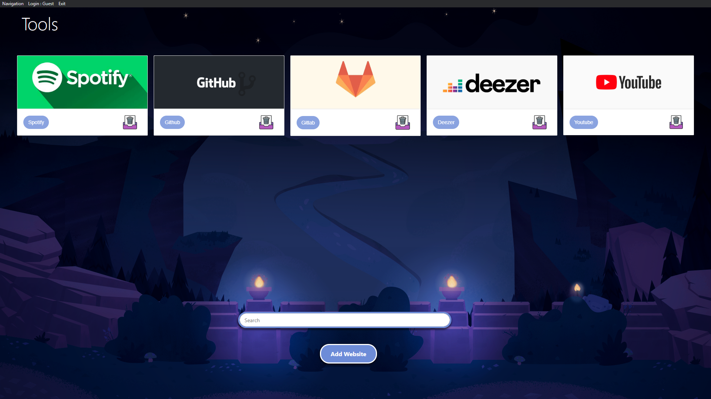
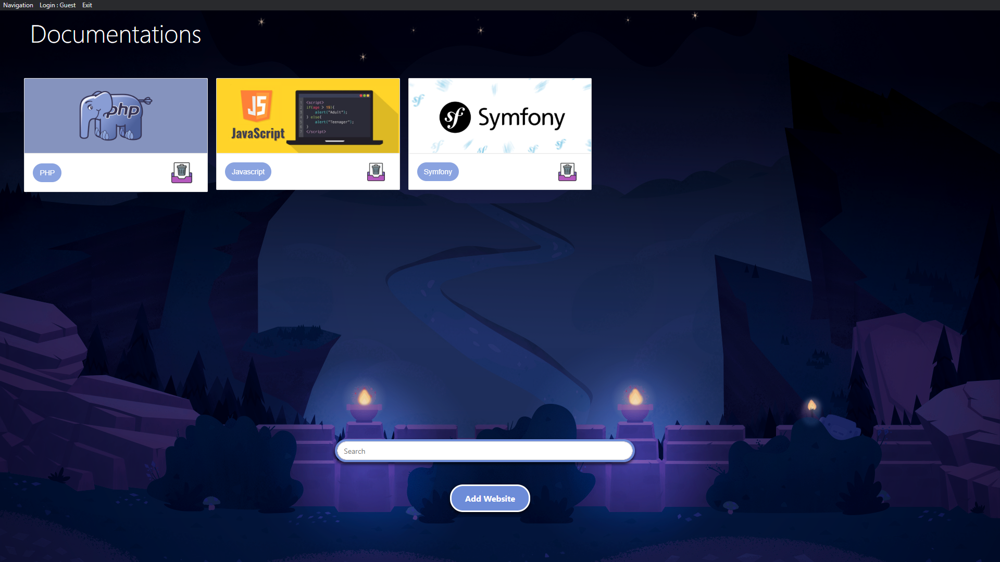
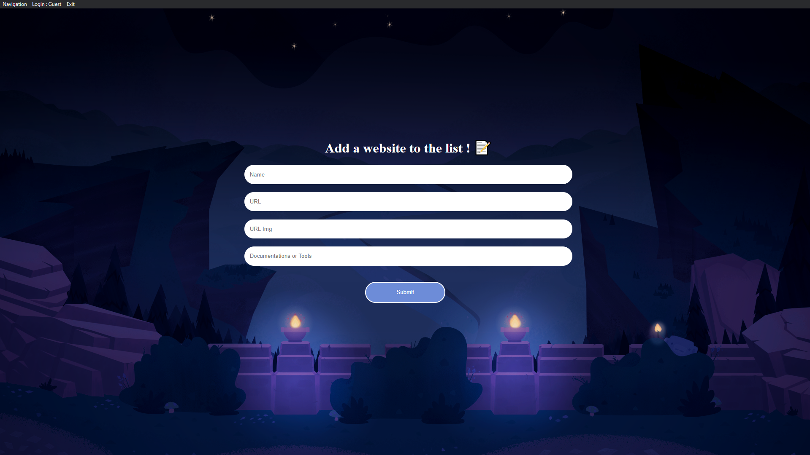

# Engine Browser 🌐

Engine Browser est un micro navigateur web permettant de pouvoir faire des recherches sur internet via le moteur Google.

Mais en plus de cela il embarque quelques fonctionnalitées facilitant la navigation.

* Ajout de site en favoris 
* Suppression de site qui sont en favoris
* Possibilité d'insérer un nom d'utilisateur
* Possibilité de faire une recherche sur Internet

### Interface lors du lancement de l'application :

*Renseignement du nom d'utilisateur*

### Liste des sites utilitaires 

*Liste des sites utilitaires qu'on à ajouté en favoris* (*Liste non exhaustive*)

### Listes des sites de documentation :

*Liste des sites de documentation qu'on à ajouté en favoris* (*Liste non exhaustive*)

### Interface d'ajout d'un site en favoris :

* Nom du site
* URL du site
* URL d'une image qu'on souhaite attribué
* Typage (Documentations ou Tools)

*Documentations = sites de documentation*
*Tools = sites utilitaires*

##### Version : 0.0.4

